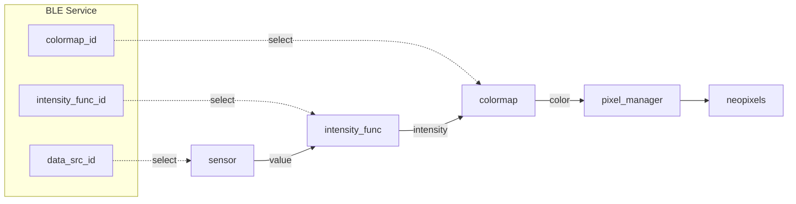

# XIAO BLE NeoPixel Controller

[](https://github.com/botamochi6277/XIAO-BLE-Neopixel-Controller/actions/workflows/ci-platformio.yml)

Control NeoPixel-strip with [Seeeduino XIAO BLE](https://wiki.seeedstudio.com/XIAO_BLE/)/[M5Stack Atom Lite](https://docs.m5stack.com/en/core/atom_lite)

You can change the lighting mode with BLE.




## lighting mode
You can choice a lighting mode in the follows.


- Periodic: pixel colors change depending on elapsed time. 
- Responsive: pixel colors change depending on sensor values.

## ColorMap

You can select colormap according to lighting mode.

+ Cyclic colormap: for cyclic value. e.g. phase and orientation angle
+ Sequential colormap: for unsigned sensor value. e.g. magnitude of acc
+ Diverging colormap: for signed value. e.g. angular velocity


- Colormap
- Intensity Function
- Arg of the intensity Function

## Service Profile

```yml
---
name: "NeopixelService"
uuid: "19B10000-E8F2-537E-4F6C-D104768A1214"
characteristics:
  - name: "timer_chr"
    uuid: "19B10001-E8F2-537E-4F6C-D104768A1214"
    data_type: "UnsignedLong"
    properties:
      - "Read"
      - "Notify"
  - name: "imu_available_chr"
    uuid: "19B10002-E8F2-537E-4F6C-D104768A1214"
    data_type: "UnsignedChar"
    properties:
      - "Read"
  - name: "num_pixels_chr"
    uuid: "19B10011-E8F2-537E-4F6C-D104768A1214"
    data_type: "UnsignedChar"
    properties:
      - "Read"
  - name: "brightness_chr"
    uuid: "19B10012-E8F2-537E-4F6C-D104768A1214"
    data_type: "UnsignedChar"
    properties:
      - "Read"
      - "Write"
  - name: "num_colors_chr"
    uuid: "19B10021-E8F2-537E-4F6C-D104768A1214"
    data_type: "UnsignedChar"
    properties:
      - "Read"
      - "Write"
  - name: "color01_chr"
    uuid: "19B10022-E8F2-537E-4F6C-D104768A1214"
    data_type: "UnsignedInt"
    properties:
      - "Read"
      - "Write"
  - name: "color02_chr"
    uuid: "19B10023-E8F2-537E-4F6C-D104768A1214"
    data_type: "UnsignedInt"
    properties:
      - "Read"
      - "Write"
  - name: "color03_chr"
    uuid: "19B10024-E8F2-537E-4F6C-D104768A1214"
    data_type: "UnsignedInt"
    properties:
      - "Read"
      - "Write"
  - name: "color04_chr"
    uuid: "19B10025-E8F2-537E-4F6C-D104768A1214"
    data_type: "UnsignedInt"
    properties:
      - "Read"
      - "Write"
  - name: "colormap_chr"
    uuid: "19B10026-E8F2-537E-4F6C-D104768A1214"
    data_type: "UnsignedChar"
    properties:
      - "Read"
      - "Write"
  - name: "lighting_mode_chr"
    uuid: "19B10028-E8F2-537E-4F6C-D104768A1214"
    data_type: "UnsignedChar"
    properties:
      - "Read"
      - "Write"
  - name: "transition_chr"
    uuid: "19B10027-E8F2-537E-4F6C-D104768A1214"
    data_type: "UnsignedChar"
    properties:
      - "Read"
      - "Write"
```

## Add XIAO BLE to PlatformIO

Alwin Arrasyid introduces the way to install XIAO BLE board to PlatformIO:  
https://medium.com/@alwint3r/working-with-seeed-xiao-ble-sense-and-platformio-ide-5c4da3ab42a3
