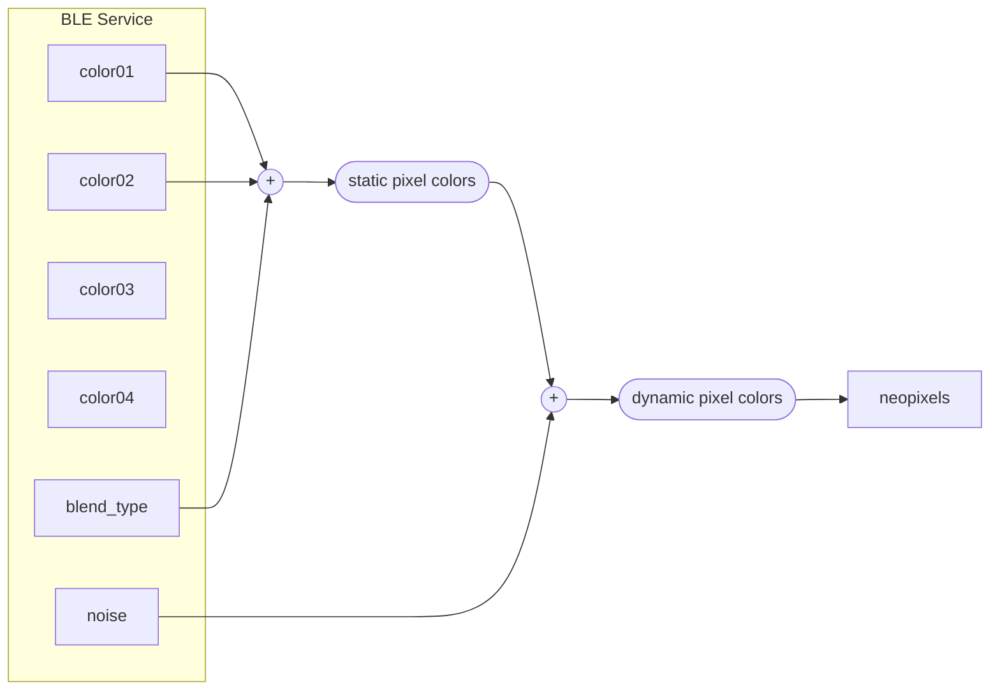

# XIAO BLE Neopixel Controller

Control Neopixel-strip with [Seeeduino XIAO BLE](https://wiki.seeedstudio.com/XIAO_BLE/)

You can change the lighting colors of the pixels with BLE.



## Service Profile

```yml
name: NeopixelService
uuid: 19B10000-E8F2-537E-4F6C-D104768A1214
characteristics:
  - name: timer_chr
    uuid: 19B10001-E8F2-537E-4F6C-D104768A1214
    data_type: UnsignedLong
    properties:
      - Read
      - Notify
  - name: num_pixels_chr
    uuid: 19B10002-E8F2-537E-4F6C-D104768A1214
    data_type: UnsignedChar
    properties:
      - Read
      - Notify
  - name: num_colors_chr
    uuid: 19B10003-E8F2-537E-4F6C-D104768A1214
    data_type: UnsignedChar
    properties:
      - Read
      - Write
      - Notify
  - name: color01_chr
    uuid: 19B10004-E8F2-537E-4F6C-D104768A1214
    data_type: UnsignedInt
    properties:
      - Read
      - Write
      - Notify
  - name: color02_chr
    uuid: 19B10005-E8F2-537E-4F6C-D104768A1214
    data_type: UnsignedInt
    properties:
      - Read
      - Write
      - Notify
  - name: color03_chr
    uuid: 19B10006-E8F2-537E-4F6C-D104768A1214
    data_type: UnsignedInt
    properties:
      - Read
      - Write
      - Notify
  - name: color04_chr
    uuid: 19B10007-E8F2-537E-4F6C-D104768A1214
    data_type: UnsignedInt
    properties:
      - Read
      - Write
      - Notify
  - name: transition_chr
    uuid: 19B10009-E8F2-537E-4F6C-D104768A1214
    data_type: UnsignedChar
    properties:
      - Read
      - Write
      - Notify
  - name: noise_chr
    uuid: 19B10010-E8F2-537E-4F6C-D104768A1214
    data_type: UnsignedChar
    properties:
      - Read
      - Write
      - Notify
  - name: blending_chr
    uuid: 19B10008-E8F2-537E-4F6C-D104768A1214
    data_type: UnsignedChar
    properties:
      - Read
      - Write
      - Notify
```

## Add XIAO BLE to PlatformIO

Alwin Arrasyid introduces the way to install XIAO BLE board to PlatformIO:  
https://medium.com/@alwint3r/working-with-seeed-xiao-ble-sense-and-platformio-ide-5c4da3ab42a3
