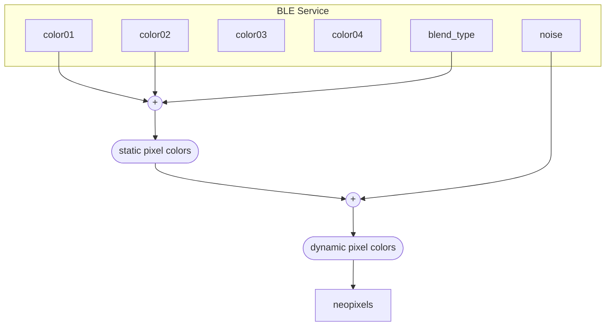

# XIAO BLE Neopixel Controller

Control Neopixel-strip with [Seeeduino XIAO BLE](https://wiki.seeedstudio.com/XIAO_BLE/)

You can change the lighting colors of the pixels with BLE.

## Add XIAO BLE to PlatformIO

Alwin Arrasyid introduces the way to install XIAO BLE board to PlatformIO:  
https://medium.com/@alwint3r/working-with-seeed-xiao-ble-sense-and-platformio-ide-5c4da3ab42a3
