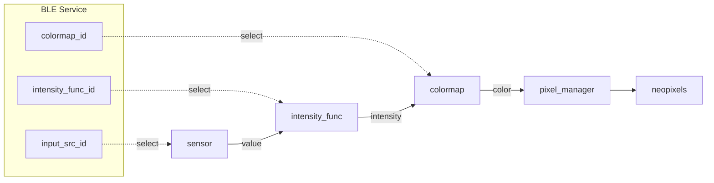
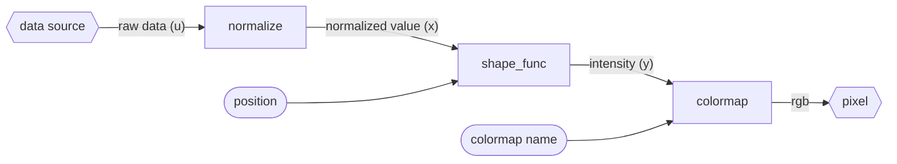

# Arduino BLE NeoPixel Controller

Control NeoPixel-strip with [Seeeduino XIAO BLE](https://wiki.seeedstudio.com/XIAO_BLE/)/[M5Stack Atom Lite](https://docs.m5stack.com/en/core/atom_lite)

You can change the lighting config with BLE. The lighting config has three parameters: `input_src_id`, `intensity_func_id`, and `colormap_id`.

```mermaid
graph LR

subgraph BLE Service
  input_src_id
  intensity_func_id
  colormap_id
end

input_src_id-.->|select|sensor
colormap_id-.->|select|colormap
intensity_func_id-.->|select|intensity_func

sensor-->|value|intensity_func-->|intensity|colormap-->|color|pixel_manager-->neopixels

```

## Color Computing Process

In the process, pixel values are computed by a value from a data source.

processing flow:

```mermaid
graph LR

data_src{{data source}}
data_src-->|"raw data (u)"|normalize-->|"normalized value (x)"|shape_func-->|"intensity (y)"|colormap-->|rgb|pixel{{pixel}}

position([position])-->shape_func
colormap_name([colormap name])-->colormap
```

### Inputs (Sources)

Input value $u$ is normalizes to 0.0--1.0. $u_\mathrm{max}$ and $u_\mathrm{min}$ are maximum and minimum values of the input, respectively. They depend on a sensor range.
$$
x = \frac{u-u_\mathrm{min}}{u_\mathrm{max}-u_\mathrm{min}}
$$

Examples:

- Beat 0.5Hz/1.0Hz/2.0Hz (30bpm/60bpm/120bpm )
- Accel X/Y/Z
- Gyro X/Y/Z

### Shape Functions (Mapping functions converting magnitude to intensity)

The shape function is a function of $x$ and $p$ which is normalized position of a pixel (0.0--1.0).
$$
y = f(x,p)
$$
Examples:

- Heat (Linear) : $`f(x,p)=a x`$
- Wipe : $`f(x,p)=\varsigma_1(x-p)`$
- Traveling Wave: $`f(x,p)=\frac{1}{2}\sin(2\pi(x-p)) +\frac{1}{2}`$
- etc.

### ColorMaps (functions converting intensity to color)

A colormap function $f_c$ returns rgb values from $y$.
$$
\left(
\begin{array}{ccc}
r & g & b \\
\end{array}
\right)^T = f_c(y)
$$

Examples:

- Hsv
- etc.
