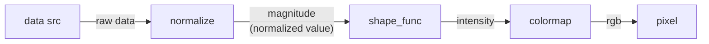

# XIAO BLE NeoPixel Controller

Control NeoPixel-strip with [Seeeduino XIAO BLE](https://wiki.seeedstudio.com/XIAO_BLE/)/[M5Stack Atom Lite](https://docs.m5stack.com/en/core/atom_lite)

You can change the lighting config with BLE. The lighting config has three parameters: `input_src_id`, `intensity_func_id`, and `colormap_id`.

processing flow:

## Lighting Config

### Inputs (Sources)
- Beat 0.5Hz/1.0Hz/2.0Hz (30bpm/60bpm/120bpm )
- Accel X/Y/Z
- Gyro X/Y/Z

### Shape Functions (Mapping functions converting magnitude to intensity)
- Heat (Linear)
- Wipe
- Traveling Wave
- etc.

### ColorMaps (functions converting intensity to color)
- Hsv
- Twilight
- TwilightShifted
- etc.

## Add XIAO BLE to PlatformIO

Alwin Arrasyid introduces the way to install XIAO BLE board to PlatformIO:  
https://medium.com/@alwint3r/working-with-seeed-xiao-ble-sense-and-platformio-ide-5c4da3ab42a3
